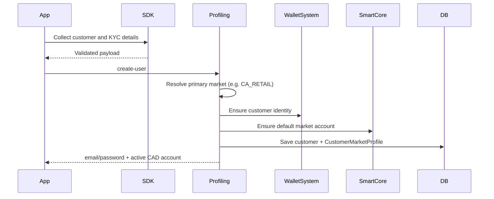
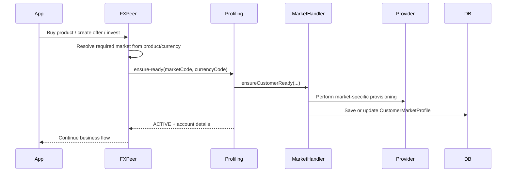
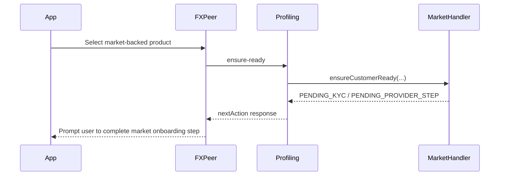

# Multi-Market Onboarding And Wallet Orchestration Blueprint

## Purpose

This document turns the current-state analysis into a safe implementation blueprint for Plural's multi-market future.

It is intentionally designed to:

- preserve current Canada and Nigeria behavior
- preserve lazy account creation from FX Peer and Investments
- avoid breaking third-party/client service integrations
- create a controlled seam for adding future markets like India, UK, US, and Euro-zone variants

## Executive Summary

Plural should stop treating new expansion as "add another currency flow" and start treating it as "add another market capability".

A **market** is not only a currency. It is the combination of:

- country or jurisdiction
- onboarding method
- KYC/compliance prerequisites
- local account creation rules
- wallet provisioning rules
- Smart Core or wallet-system integration behavior
- funding and withdrawal capabilities
- product eligibility

This means:

- `CAD` is not the architecture
- `NGN` is not the architecture
- `Country` alone is not the architecture
- the real operational unit is `Market`

Examples:

- `CA_RETAIL`
- `NG_RETAIL`
- `IN_RETAIL`
- `EU_ES_RETAIL`
- `EU_DE_RETAIL`

They may share currencies, but they will not always share onboarding, compliance, or provider behavior.

## Current Platform Shape

### What is good today

- Profiling already owns customer onboarding and wallet identity.
- FX Peer already performs lazy account creation when a required market account is missing.
- Canada and Nigeria are already proving two different onboarding patterns.
- Existing third-party integrations are usable if we wrap them behind stable orchestration interfaces.

### What is risky today

- Canada and Nigeria are implemented as special cases rather than as market handlers.
- `add-other-currency-account` sounds generic but is effectively Nigeria-specific today.
- FX Peer, Investments, Airtime, and Transactions already contain CAD and NGN assumptions.
- Country, currency, and onboarding behavior are mixed in code and partially mixed in reference data.
- Adding each new country the current way will force repeated edits across multiple services and increase regression risk.

## What Must Not Change

The refactor must preserve these behaviors:

1. App onboarding can still begin with the bundled SDK flow for Canada.
2. Nigeria second-account onboarding can still be triggered after BVN validation.
3. FX Peer can still lazily ensure a missing account when a user selects a market-backed product or flow.
4. Smart Core, wallet-system, BreezePay, quote, and related provider API contracts remain unchanged.
5. Existing mobile flows should still work while the new architecture is introduced behind the scenes.

## Core Architectural Decision

### Separate these three concepts

#### 1. Country

Reference and ISO identity data:

- ISO code
- display name
- dialing metadata
- regulatory grouping if needed

Examples:

- `CA`
- `NG`
- `IN`
- `ES`
- `DE`

#### 2. Currency

Money unit:

- `CAD`
- `NGN`
- `USD`
- `EUR`
- `GBP`
- `INR`

#### 3. Market

Operational behavior:

- onboarding type
- KYC prerequisites
- provider integrations
- wallet creation policy
- Smart Core mapping
- product enablement
- FX capabilities

Examples:

- `CA_RETAIL` -> country `CA`, default currency `CAD`
- `NG_RETAIL` -> country `NG`, default currency `NGN`
- `EU_ES_RETAIL` -> country `ES`, currency `EUR`
- `EU_DE_RETAIL` -> country `DE`, currency `EUR`

## Target Domain Model

### MarketDefinition

Represents a supported market configuration.

Suggested fields:

```text
id
marketCode
countryCode
defaultCurrency
displayName
onboardingType
kycProviderType
accountProviderType
walletProvisioningType
smartCoreProfileType
requiresPrimaryOnboarding
requiresBvn
requiresSdkCompletion
supportsFxPeer
supportsInvestment
supportsAirtime
supportsFunding
supportsWithdrawal
enabled
metadataJson
createdAt
updatedAt
```

### CustomerMarketProfile

Represents a customer's status in a market.

Suggested fields:

```text
id
customerId
marketCode
countryCode
currencyCode
status
kycStatus
accountProvisionStatus
walletProvisionStatus
externalProviderReference
smartCoreCustomerId
smartCoreAccountId
localAccountNumber
virtualAccountNumber
primaryForCustomer
metadataJson
createdAt
updatedAt
```

Possible status values:

- `NOT_STARTED`
- `PENDING_KYC`
- `PENDING_PROVIDER_ACCOUNT`
- `ACTIVE`
- `SUSPENDED`
- `FAILED`

### MarketProductEligibility

Represents whether a market can access a product or service.

Suggested fields:

```text
id
marketCode
productType
productReference
enabled
rulesJson
createdAt
updatedAt
```

## Proposed Service Responsibilities

### Profiling Service

Profiling remains the orchestration owner for:

- primary onboarding
- market onboarding
- KYC prerequisites
- local account provisioning
- Smart Core/wallet-system registration
- customer market readiness

Profiling should become the single place that answers:

- is this user enabled for market X?
- if not, can we create the account now?
- if not, what exact prerequisite is missing?

### FX Peer Service

FX Peer should stop owning detailed country logic.

FX Peer should only:

- determine that a selected offer or product requires `market X`
- ask profiling to `ensureCustomerMarketReady(...)`
- proceed if the account is ready
- return a clear next-step response if the account cannot yet be auto-provisioned

### Transactions Service

Transactions should not decide onboarding behavior.

Transactions should only consume:

- market-aware account or wallet info
- market-aware GL mapping or provider mapping

### Backoffice

Backoffice should eventually manage:

- enabled markets
- market metadata
- provider linkage by market
- product eligibility by market
- rollout toggles

## Proposed Internal Interfaces

These interfaces are the safe seam.

### MarketOnboardingHandler

```java
public interface MarketOnboardingHandler {
    boolean supports(String marketCode);
    MarketReadinessResponse ensureCustomerReady(MarketReadinessRequest request);
}
```

### MarketKycHandler

```java
public interface MarketKycHandler {
    boolean supports(String marketCode);
    KycResolutionResult resolveKyc(KycResolutionRequest request);
}
```

### MarketAccountProvisioner

```java
public interface MarketAccountProvisioner {
    boolean supports(String marketCode);
    AccountProvisionResult provision(AccountProvisionRequest request);
}
```

### MarketWalletSystemAdapter

```java
public interface MarketWalletSystemAdapter {
    boolean supports(String marketCode);
    WalletSystemProvisionResult ensureWalletIdentity(WalletSystemProvisionRequest request);
}
```

### MarketProductEligibilityService

```java
public interface MarketProductEligibilityService {
    EligibilityResult evaluate(String customerId, String marketCode, String productType, String productRef);
}
```

## First Concrete Handlers

### CanadaMarketOnboardingHandler

Responsibilities:

- validate SDK-derived customer profile completion
- ensure local customer/wallet identity exists
- ensure CAD wallet-system linkage exists
- ensure Smart Core customer/account linkage exists if required
- create `CustomerMarketProfile(CA_RETAIL, CAD)`

### NigeriaMarketOnboardingHandler

Responsibilities:

- confirm BVN validation state
- create NGN virtual account using current provider flow
- register user in wallet-system
- create `CustomerMarketProfile(NG_RETAIL, NGN)`

These two handlers should wrap existing working logic first, not replace provider flows.

## Public API Direction

### Keep current APIs working

Do not break:

- `POST /walletmgt/create-user`
- `POST /walletmgt/validate/bvn`
- `POST /walletmgt/add-other-currency-account`

### Introduce new internal orchestration API

Suggested internal-first endpoint:

```text
POST /walletmgt/markets/ensure-ready
```

Request:

```json
{
  "customerId": "1799204705",
  "marketCode": "NG_RETAIL",
  "currencyCode": "NGN",
  "triggerSource": "FXPEER",
  "productType": "INVESTMENT"
}
```

Response:

```json
{
  "status": "ACTIVE",
  "marketCode": "NG_RETAIL",
  "currencyCode": "NGN",
  "accountNumber": "08162325876",
  "nextAction": null,
  "message": "Market account ready"
}
```

Or if not ready:

```json
{
  "status": "PENDING_KYC",
  "marketCode": "NG_RETAIL",
  "currencyCode": "NGN",
  "accountNumber": null,
  "nextAction": "COMPLETE_MARKET_KYC",
  "message": "Market KYC required"
}
```

### Later external API direction

Over time, `add-other-currency-account` can become a compatibility wrapper that resolves market and calls the new orchestrator.

## Runtime Flow Design

### Flow A: Primary onboarding for default market



### Flow B: Lazy account creation from FX Peer or Investments



### Flow C: Market requires unfinished prerequisite



## Dependency Inventory

### Profiling

Current dependency hotspots:

- `WalletMgtController`
- `WalletServices`
- `AddAccountService`
- `CountryService`
- `CountryDataLoader`
- `CountriesController`

Key concerns:

- primary onboarding and secondary onboarding are not unified
- market-specific behavior is embedded in service methods
- country and currency concerns are mixed with enablement logic
- BVN cache and Nigeria flow are special-cased

### FX Peer

Current dependency hotspots:

- `ProfilingProxies`
- `OrderService`
- `OfferService`
- `InvestmentOrderService`
- `ProcSochitelServices`

Key concerns:

- service determines account readiness by inspecting `AddAccountDetails`
- CAD is treated specially in many flows
- runtime lazy provisioning is useful, but the provisioning contract is too country-specific today

### Transactions

Current dependency hotspots:

- `LocalTransferService`
- wallet validation / GL mapping paths
- webhook and transfer flows with currency-specific assumptions

Key concerns:

- currency-specific assumptions may grow with each market
- market enablement must not leak into transaction orchestration

## Country And ISO Strategy

Plural should stop using country sources inconsistently for operational logic.

### Keep these separate

#### CountryReference

Reference data:

- ISO code
- name
- dial code
- maybe continent or region

This can still be derived from DB plus ISO fallback.

#### CurrencyReference

Reference data:

- code
- symbol
- display name
- decimal rules if needed

#### MarketDefinition

Operational enablement:

- which country
- which currency
- which onboarding style
- which provider
- which services are allowed

### Practical rule

- `Countries` table should not decide onboarding behavior by itself
- `AppConfig` currency matching should not be the long-term operational source of truth
- `MarketDefinition` should become the operational source of truth

## Migration Strategy

### Phase 0: Analysis and containment

- complete dependency inventory
- agree naming of market model
- freeze ad hoc new-country additions until seam is introduced

### Phase 1: Introduce market model in profiling

- add `MarketDefinition`
- add `CustomerMarketProfile`
- add handler interfaces
- implement `CA_RETAIL` and `NG_RETAIL` adapters using existing working logic
- keep old controller endpoints intact

### Phase 2: Introduce orchestration endpoint

- add internal `ensure-ready` API
- make old `add-other-currency-account` call into orchestration layer
- preserve current response semantics where needed

### Phase 3: Route FX Peer through orchestration

- replace direct Nigeria-shaped add-account assumptions
- centralize market readiness checks
- remove duplicated country logic from offer/order/investment flows gradually

### Phase 4: Harden transactions dependencies

- externalize market-aware account and GL metadata
- reduce direct currency branching where practical

### Phase 5: Add future markets

- India
- UK
- US
- Euro variants

These should be new handlers plus config, not wide cross-service edits.

## Safe First Coding Cut

The safest first implementation cut is:

1. add market tables and model classes in profiling
2. implement market handler interfaces
3. wrap current Canada and Nigeria flows behind handlers
4. add internal `ensure-ready` orchestration method
5. keep existing controller contracts intact

This is the smallest change that creates a future-proof seam without breaking money flows.

## Current Implementation Note

The `codex/multi-market-onboarding-architecture-hardening` branch has already progressed beyond the initial Phase 1 scaffold inside profiling:

- `MarketDefinition` and `CustomerMarketProfile` are implemented
- `CA_RETAIL` and `NG_RETAIL` handlers exist
- the internal `POST /walletmgt/markets/ensure-ready` orchestration endpoint exists
- Canada SDK onboarding, Nigeria BVN validation, and Nigeria account provisioning already sync `CustomerMarketProfile`
- `POST /walletmgt/add-other-currency-account` now preflights `NG_RETAIL` readiness through orchestration before continuing with the existing BVN, OTP, and account-provisioning flow
- FXPeer non-CAD investment and airtime flows now only fall back to legacy linked-account discovery when orchestration is unavailable; if readiness explicitly returns an inactive or pending market state, that response is now treated as authoritative

This keeps the legacy mobile contract stable while moving readiness decisions behind the market-aware orchestration seam.

## No-Regression Rules

Before merging any implementation:

1. Canada primary onboarding must still create the expected CAD account.
2. Nigeria BVN validation plus secondary-account creation must still work.
3. FX Peer buy/create-offer/investment flows must still lazily provision missing supported accounts.
4. Existing third-party request and response payloads must remain unchanged.
5. Transactions, wallet balances, and account-number mapping must remain stable.

## Recommended Branch Naming

The current working branch is:

```text
codex/multi-market-onboarding-architecture-hardening
```

That name is good because this is not just a feature. It is a controlled architecture hardening and scalability optimization.

## Branch Sync Workflow

The current stable branch for dev and staging is:

```text
feature/after-first-user-experience-test-on-dev
```

The long-running architecture branch is:

```text
codex/multi-market-onboarding-architecture-hardening
```

Use this rule consistently:

- stable feeds working branch
- urgent fixes and environment-stable changes go to `feature/after-first-user-experience-test-on-dev`
- unfinished architecture work continues on `codex/multi-market-onboarding-architecture-hardening`

Every time a fix is made on the stable branch, sync it into the architecture branch before continuing the larger work:

```bash
git checkout codex/multi-market-onboarding-architecture-hardening
git fetch origin
git merge origin/feature/after-first-user-experience-test-on-dev
git push origin codex/multi-market-onboarding-architecture-hardening
```

After the sync merge is complete, switch back to the stable branch if that is still the active deployment branch for the day:

```bash
git checkout feature/after-first-user-experience-test-on-dev
```

Operational reminder:

- fix on `feature/after-first-user-experience-test-on-dev`
- sync into `codex/multi-market-onboarding-architecture-hardening`
- switch back to the branch you are actively deploying from

Use merge, not rebase, for this sync flow so shared history stays stable and the architecture branch keeps a visible record of stable-branch updates.

## Next Deliverables

1. A service-by-service CAD and NGN dependency inventory with file references.
2. A target data model for `MarketDefinition` and `CustomerMarketProfile`.
3. A compatibility matrix for Canada and Nigeria behaviors.
4. A profiling-first implementation plan with exact classes, endpoints, and migration order.
