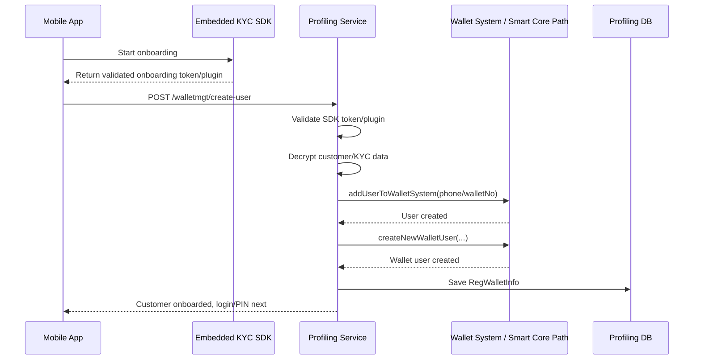
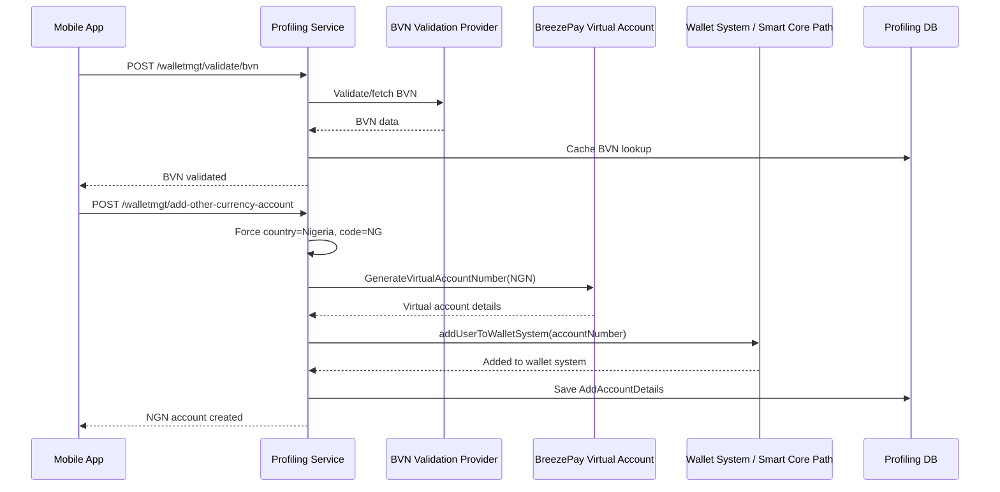
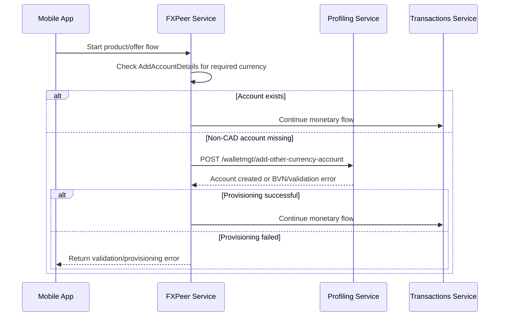

# Plural Multi-Market Onboarding and Wallet Architecture Analysis

## Purpose
This document captures the current onboarding, account provisioning, FX peer, investment, and transaction architecture across Plural services and proposes a safer market-aware design before multi-country expansion.

The immediate goal is to preserve the current production intent:
- Canada onboarding remains the default entry onboarding path.
- Nigeria remains a secondary account onboarding flow triggered after BVN validation.
- FX peer, airtime, and investments may provision missing market accounts on demand when a customer selects a product or flow that requires them.
- Existing third-party provider contracts must remain intact.

## Repositories and Services Reviewed
- `finacial-wealth-api-profiling`
- `finacial-wealth-api-fxpeer-exchange`
- `finacial-wealth-api-transactions`
- `finacial-wealth-api-utility`
- `finacial-wealth-api-sessionmanager`
- `finacial-wealth-gateway`

## Key Findings
1. The current solution works for Canada plus Nigeria, but the design already carries hardcoded CAD and NGN assumptions in multiple services.
2. The system is evolving into a multi-market platform, not just a multi-currency platform.
3. Country onboarding rules, local account creation rules, Smart Core registration, and wallet/GL behavior are mixed together in service logic.
4. FX peer already depends on profiling for lazy account creation during customer flows.
5. Without architecture hardening, each new country will require touching profiling, fxpeer, transactions, and possibly utility/session logic, increasing risk and drift.

## Current State Summary

### 1. Default Canada onboarding
Profiling handles the primary onboarding journey through SDK-driven validation and customer creation.

Relevant code:
- `finacial-wealth-api-profiling/src/main/java/com/finacial/wealth/api/profiling/controllers/WalletMgtController.java`
- `finacial-wealth-api-profiling/src/main/java/com/finacial/wealth/api/profiling/services/WalletServices.java`

Important flows:
- `POST /walletmgt/create-user`
- `WalletServices.onboardUserForSDKCaller(...)`
- `WalletServices.onboardUserForSDK(...)`
- `WalletServices.addUserToWalletSystem(...)`
- `WalletServices.createNewWalletUser(...)`

Observed behavior:
- SDK token/plugin is validated.
- Customer/KYC details are decrypted from the onboarding provider.
- Profiling builds `RegWalletInfo`.
- A wallet-system user is created.
- A local wallet user is created.
- The customer is persisted and prepared for login/PIN creation.
- The current default wallet number and phone identity model strongly align with the Canada-first experience.

### 2. Nigeria onboarding as secondary account addition
Nigeria is not modeled as a generic market handler today. It is a special second-account path.

Relevant code:
- `finacial-wealth-api-profiling/src/main/java/com/finacial/wealth/api/profiling/controllers/WalletMgtController.java`
- `finacial-wealth-api-profiling/src/main/java/com/finacial/wealth/api/profiling/services/AddAccountService.java`
- `finacial-wealth-api-profiling/src/main/java/com/finacial/wealth/api/profiling/breezpay/virt/get/bvn/BvnService.java`

Important endpoints:
- `POST /walletmgt/validate/bvn`
- `POST /walletmgt/add-other-currency-account`

Observed behavior:
- BVN must be validated first.
- `AddAccountService.addAccount(...)` forcefully sets:
  - `countryCode = NG`
  - `country = Nigeria`
- It validates cached BVN data.
- It provisions an NGN account through BreezePay virtual account generation.
- It also registers the account into the wallet system via `walletServices.addUserToWalletSystem(...)`.

This means `/add-other-currency-account` is currently shaped as a Nigeria-specific provisioning endpoint even though its name sounds generic.

### 3. FX peer lazy account creation
FX peer does not only consume existing customer accounts. It also lazily provisions missing non-CAD accounts by calling profiling at runtime.

Relevant code:
- `finacial-wealth-api-fxpeer-exchange/src/main/java/com/finacial/wealth/api/fxpeer/exchange/order/OrderService.java`
- `finacial-wealth-api-fxpeer-exchange/src/main/java/com/finacial/wealth/api/fxpeer/exchange/offer/OfferService.java`
- `finacial-wealth-api-fxpeer-exchange/src/main/java/com/finacial/wealth/api/fxpeer/exchange/inter/airtime/security/ProcSochitelServices.java`
- `finacial-wealth-api-fxpeer-exchange/src/main/java/com/finacial/wealth/api/fxpeer/exchange/investment/service/InvestmentOrderService.java`
- `finacial-wealth-api-fxpeer-exchange/src/main/java/com/finacial/wealth/api/fxpeer/exchange/feign/ProfilingProxies.java`

Observed behavior:
- FX peer checks `AddAccountDetails` for the required currency account.
- If a non-CAD account is required and missing, it calls profiling:
  - `POST /walletmgt/add-other-currency-account`
- This happens in live customer flows such as:
  - offer creation
  - offer purchase
  - airtime purchase
  - investment purchase
- CAD is treated specially in several places, often falling back to phone number identity instead of a separate local account number.

### 4. Transactions and ledger behavior
Transactions already contain market/currency-specific ledger assumptions.

Relevant code:
- `finacial-wealth-api-transactions/src/main/java/com/financial/wealth/api/transactions/services/LocalTransferService.java`
- `finacial-wealth-api-transactions/src/main/java/com/financial/wealth/api/transactions/tranfaar/services/WebhookKeyService.java`
- `finacial-wealth-api-transactions/src/main/java/com/financial/wealth/api/transactions/services/fx/p2/p2/wallet/ManageWalletService.java`

Observed behavior:
- CAD-specific GL handling appears repeatedly.
- Quote and webhook flows assume certain currency-ledger mappings.
- The transaction service is not yet market-agnostic.

### 5. Currency support model
Relevant code:
- `finacial-wealth-api-fxpeer-exchange/src/main/java/com/finacial/wealth/api/fxpeer/exchange/common/CurrencyCode.java`

Observed behavior:
- Currency support is modeled as a hardcoded enum: `NGN, CAD, USD, EUR, GBP`.
- This is fine for validation, but not enough to represent country-market onboarding and provisioning policy.

## Current End-to-End Flows

### Canada default onboarding flow

### Nigeria second-account flow

### FX peer lazy account creation during buy/invest/use flow

## Why This Will Struggle at Scale

### 1. Country logic is encoded as currency logic
Today there is an implicit shortcut:
- CAD means default onboarding path
- NGN means special secondary path

That breaks down quickly for:
- INR in India
- USD in different jurisdictions
- EUR across multiple European countries
- GBP in UK-specific compliance flows

### 2. Generic endpoint names mask non-generic behavior
`/add-other-currency-account` sounds generic, but the implementation is currently Nigeria-shaped.

### 3. Multiple services know too much about country-specific onboarding
At the moment:
- profiling knows the local onboarding steps
- fxpeer knows when to call account creation
- transactions knows certain currency-ledger special cases

This creates broad change impact for every new market.

### 4. Product availability and account eligibility are coupled informally
The mobile app can show products by country/currency, and then fxpeer decides at runtime whether to create the missing account. That behavior is useful, but it needs a formal market capability model.

## Architectural Principle Going Forward
Plural should model **markets** first, then countries, then currencies, then providers.

### Proposed key distinction
- `Market`: operational + compliance domain, e.g. `CA`, `NG`, `IN`, `EU_ES`, `EU_DE`
- `Currency`: financial denomination, e.g. `CAD`, `NGN`, `INR`, `EUR`
- `Provider`: third-party implementation, e.g. BreezePay, Smart Core, quote provider, KYC SDK

A currency can exist in multiple markets.
A market may have one or more currencies.
A market decides the onboarding and provisioning rules.

## Target Architecture

### A. Market-aware onboarding orchestration
Introduce a profiling orchestration layer that routes onboarding and account provisioning by market.

Suggested interfaces:
- `MarketOnboardingHandler`
- `MarketAccountProvisioningHandler`
- `MarketKycValidationHandler`
- `MarketWalletProvisioningPolicy`
- `MarketSmartCoreAdapter`

Example implementations:
- `CanadaMarketHandler`
- `NigeriaMarketHandler`
- `IndiaMarketHandler`
- `EuroSpainMarketHandler`
- `EuroGermanyMarketHandler`

### B. Market registry / configuration model
Create a configuration model for markets, for example:
- market code
- country code
- supported currencies
- onboarding mode
- KYC provider
- local account provider
- Smart Core adapter mode
- FX enabled
- investment enabled
- airtime enabled
- requires lazy account provisioning
- primary/default market flag

This should be data/config driven rather than spread across enums and service branches.

### C. Preserve lazy provisioning, but formalize it
Do not remove the current user experience where selecting a product can trigger account creation.
Instead, make it explicit.

Proposed runtime contract:
- FX peer asks profiling: `ensureAccountForMarket(user, market, currency)`
- Profiling decides whether:
  - account already exists
  - KYC prerequisite is missing
  - market onboarding step is required
  - account can be provisioned immediately

That preserves the current behavior while moving the decision into the right service.

### D. Make products market-aware
Products in FX peer and investments should map to a market capability, not just currency.

Example:
- `Nigeria Prime Money Market Fund` -> market `NG`, currency `NGN`
- `Canada Prime Money Market Fund` -> market `CA`, currency `CAD`
- future `India Fixed Income` -> market `IN`, currency `INR`
- future `Spain Euro Fund` -> market `EU_ES`, currency `EUR`

Then the app and backend can decide:
- whether the customer is already eligible
- whether an account can be lazily created
- whether additional onboarding is needed

### E. Reduce direct currency branching in downstream services
Transactions and FX peer should not keep growing with:
- `if CAD`
- `if NGN`
- `if not CAD`

Instead they should ask policy/config services for:
- settlement account resolution
- GL routing
- wallet/account identity rules
- whether phone number or local account number is used

## Recommended Refactor Scope Before Go-Live
Do not rewrite everything before launch.
Do a controlled hardening.

### Phase 1: Analysis and documentation
- Document current flows
- Catalog country/currency/provider assumptions
- Identify hot spots where adding markets will require code changes

### Phase 2: Introduce market domain without changing external APIs
- Add market model/config
- Add orchestration interfaces in profiling
- Keep current endpoints and provider calls intact
- Internally route Canada and Nigeria through handler implementations

### Phase 3: Introduce an ensure-account orchestration endpoint
New internal intent, without breaking current mobile behavior:
- `ensureAccountForMarket(...)`

FX peer can continue calling profiling, but through a cleaner market-aware path.

### Phase 4: Move product gating to market capability checks
- Product requires market X and currency Y
- Backend checks whether the customer has that market account or can be provisioned

### Phase 5: Gradually remove hardcoded CAD/NGN assumptions from FX peer and transactions
This should be phased carefully after the market layer exists.

## What Must Be Preserved
1. Existing provider API contracts
- BreezePay
- Smart Core / wallet system
- quote/transfaar-like providers
- existing profiling/fxpeer/transactions contracts where mobile already depends on them

2. Existing customer experience
- Default Canada onboarding
- Nigeria second account flow
- ability to select a market/currency-backed product and be prompted or provisioned accordingly

3. Safety for money movement
- No refactor should change settled posting behavior casually
- All market onboarding changes must remain upstream of the actual monetary legs

## Proposed New Internal Concepts

### Market
Represents onboarding/compliance/operations domain.

Fields to consider:
- `marketCode`
- `countryCode`
- `displayName`
- `primaryCurrency`
- `supportedCurrencies`
- `requiresKyc`
- `kycMode`
- `accountProvisioningMode`
- `walletIdentityMode`
- `providerConfigRef`
- `enabled`

### CustomerMarketProfile
Tracks a user’s status within a market.

Fields to consider:
- `walletId`
- `marketCode`
- `status` (`NOT_STARTED`, `PENDING_KYC`, `READY_FOR_PROVISIONING`, `ACTIVE`, `BLOCKED`)
- `kycReference`
- `localAccountReference`
- `smartCoreReference`
- `lastUpdatedAt`

### MarketProductEligibility
Maps products to required market/currency and provisioning rules.

## Design Recommendation for Mobile/API Experience
Keep the mobile simplicity.

Suggested behavior:
- app shows product
- app calls backend to begin purchase/offer/subscription
- backend checks if required market account exists
- if not, backend returns one of:
  - can auto-provision now
  - requires prerequisite validation
  - requires market onboarding completion
- mobile shows guided next step

This is better than pushing market logic into the app.

## Immediate Risks If No Hardening Is Done
1. Every new country increases branching in profiling, fxpeer, and transactions.
2. Product expansion becomes risky because account readiness is not modeled cleanly.
3. EUR-style shared currency markets become confusing because currency does not equal market.
4. Compliance/provider changes will force broad edits across services.
5. Regression risk grows with every new country launch.

## Recommendation
Before adding the next markets after launch, Plural should implement a market-aware orchestration layer centered in profiling, while keeping the current third-party API contracts and customer-facing flows unchanged.

In short:
- keep the current behavior
- stop encoding new markets as more `if CAD / if NGN / if not CAD`
- formalize market onboarding and account provisioning
- make FX peer ask profiling for account readiness rather than re-deriving market logic itself

## Suggested Next Deliverables
1. A market capability inventory across current services
2. A dependency map of all CAD/NGN-specific branches
3. A target domain model for Market and CustomerMarketProfile
4. A small implementation plan to refactor Canada and Nigeria first
5. A no-regression checklist for money flows, onboarding, FX peer, airtime, and investments

## Branch
This analysis is being prepared on branch:
- `codex/multi-market-onboarding-architecture-hardening`

## Country and ISO Management Findings

Profiling already has a mixed country-management model that should be folded into the market-aware design.

Relevant code:
- `finacial-wealth-api-profiling/src/main/java/com/finacial/wealth/api/profiling/controllers/CountriesController.java`
- `finacial-wealth-api-profiling/src/main/java/com/finacial/wealth/api/profiling/services/CountryService.java`
- `finacial-wealth-api-profiling/src/main/java/com/finacial/wealth/api/profiling/services/CountryDataLoader.java`
- `finacial-wealth-api-profiling/src/main/java/com/finacial/wealth/api/profiling/domain/Countries.java`

Observed behavior:
- Some country data is read from the `Countries` table.
- Some country/currency data can be generated from JDK `Locale.getISOCountries()` and `Currency`.
- Country validation sometimes matches on `countryCode + country name`.
- Currency validation sometimes matches `AppConfig.configName` to `Countries.currencyCode`.
- `/countries/without-currency` returns a DB-backed country list.
- `/countries/all/existing` returns raw existing DB country rows.
- There is a lazy-seeding style path for full country/currency generation in `listCountriesWithCurrency()`, though it is not currently exposed by the active controller.

Implication:
- Country, currency, and market are not yet cleanly separated.
- ISO country code is useful as reference data, but it should not by itself define onboarding or account-provisioning behavior.
- The future design should keep ISO-backed reference data, but add explicit market metadata and provider capability metadata on top of it.

### Recommended Country/Market Layering
1. `Country` should remain the ISO/reference concept.
2. `Currency` should remain the ISO-4217 money concept.
3. `Market` should be the operational concept that points to a country and one or more currencies.
4. Provider capability should be attached to `Market`, not inferred only from `Country` or `Currency`.

Example:
- `Country = ES`
- `Currency = EUR`
- `Market = EU_ES_RETAIL`

This avoids turning every EUR country into the same onboarding rule.
