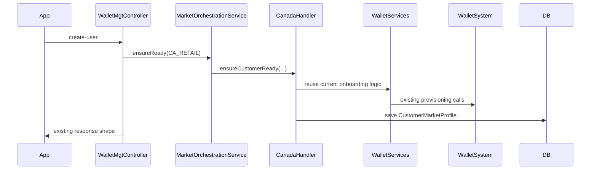
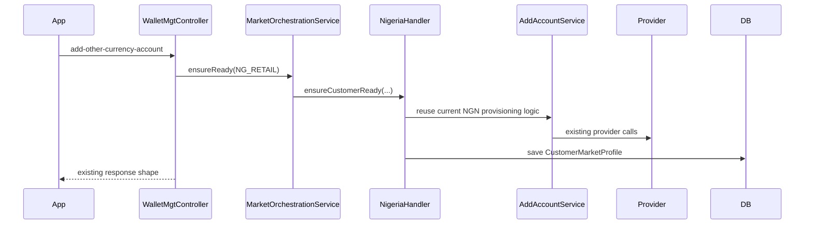
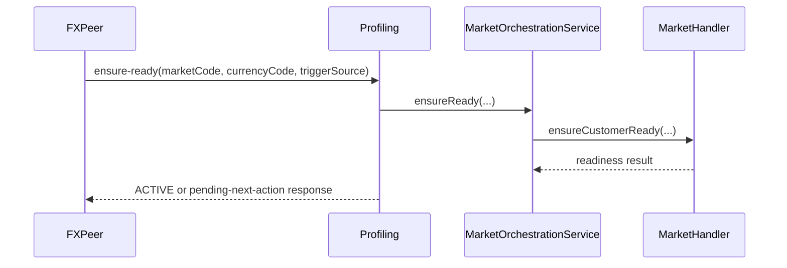

# Multi-Market Profiling-First Technical Spec

## Purpose

This document is the implementation-ready design for the first safe refactor seam of the multi-market optimization.

It is intentionally profiling-first because:

- profiling already owns onboarding and account provisioning orchestration
- profiling can absorb the market model without changing frontend contracts first
- FX Peer can adopt the seam later with lower risk
- transactions can stay stable while onboarding is hardened

This spec is designed to be backward compatible.

## Goals

1. Introduce market-aware orchestration without changing current frontend/mobile contracts.
2. Preserve Canada default onboarding.
3. Preserve Nigeria BVN-driven second-account onboarding.
4. Preserve lazy account creation from FX Peer and Investments.
5. Preserve third-party request and response payloads.
6. Make future market additions adapter-based instead of cross-service branching.

## Non-Goals For Phase 1

1. Redesigning mobile onboarding.
2. Replacing current third-party provider APIs.
3. Reworking transactions money movement logic.
4. Replacing all existing customer/account tables immediately.
5. Forcing backoffice or session-manager contract changes.

## Phase 1 Design Principle

The external shell remains the same.

The internal orchestration changes from:

- country/currency special-case methods

to:

- market-aware handler orchestration

## Current Compatibility Surface

These profiling endpoints remain active and backward compatible:

- `POST /walletmgt/create-user`
- `POST /walletmgt/validate/bvn`
- `POST /walletmgt/add-other-currency-account`

New market-aware orchestration is introduced internally first and can later be exposed through a new internal endpoint when safe.

## New Core Concepts

## 1. MarketDefinition

Defines a supported operational market.

### Example meanings

- `CA_RETAIL`
- `NG_RETAIL`
- `IN_RETAIL`
- `EU_ES_RETAIL`

### Proposed entity fields

```java
public class MarketDefinition {
    private Long id;
    private String marketCode;
    private String countryCode;
    private String defaultCurrencyCode;
    private String displayName;
    private String onboardingType;
    private String kycProviderType;
    private String accountProviderType;
    private String walletProvisioningType;
    private String smartCoreProfileType;
    private Boolean requiresPrimaryOnboarding;
    private Boolean requiresBvn;
    private Boolean requiresSdkCompletion;
    private Boolean supportsFxPeer;
    private Boolean supportsInvestment;
    private Boolean supportsAirtime;
    private Boolean supportsFunding;
    private Boolean supportsWithdrawal;
    private Boolean enabled;
    private String metadataJson;
    private Date createdAt;
    private Date updatedAt;
}
```

### Notes

- `countryCode` is ISO-style reference data.
- `defaultCurrencyCode` is the market’s primary currency.
- `metadataJson` can carry market-specific rollout flags and provider settings without widening the table immediately.

## 2. CustomerMarketProfile

Represents a customer’s status in a given market.

### Proposed entity fields

```java
public class CustomerMarketProfile {
    private Long id;
    private String customerId;
    private String emailAddress;
    private String marketCode;
    private String countryCode;
    private String currencyCode;
    private String status;
    private String kycStatus;
    private String accountProvisionStatus;
    private String walletProvisionStatus;
    private String externalProviderReference;
    private String smartCoreCustomerId;
    private String smartCoreAccountId;
    private String localAccountNumber;
    private String virtualAccountNumber;
    private Boolean primaryForCustomer;
    private String metadataJson;
    private Date createdAt;
    private Date updatedAt;
}
```

### Suggested status values

For `status`:

- `NOT_STARTED`
- `PENDING_KYC`
- `PENDING_ACCOUNT_PROVISION`
- `PENDING_WALLET_PROVISION`
- `ACTIVE`
- `FAILED`
- `SUSPENDED`

For `kycStatus`:

- `NOT_REQUIRED`
- `PENDING`
- `VALIDATED`
- `FAILED`

For `accountProvisionStatus`:

- `NOT_STARTED`
- `PENDING`
- `PROVISIONED`
- `FAILED`

For `walletProvisionStatus`:

- `NOT_STARTED`
- `PENDING`
- `PROVISIONED`
- `FAILED`

## 3. MarketResolution

An internal helper concept rather than necessarily a stored entity.

Purpose:

- map runtime intent into a market decision

Examples:

- product in NGN investment -> `NG_RETAIL`
- selected CAD FX offer -> `CA_RETAIL`
- future Euro Spain product -> `EU_ES_RETAIL`

## New Repository Interfaces

### MarketDefinitionRepo

```java
public interface MarketDefinitionRepo extends JpaRepository<MarketDefinition, Long> {
    Optional<MarketDefinition> findByMarketCodeIgnoreCase(String marketCode);
    List<MarketDefinition> findByEnabledTrue();
    Optional<MarketDefinition> findByCountryCodeIgnoreCaseAndDefaultCurrencyCodeIgnoreCase(
        String countryCode, String defaultCurrencyCode
    );
}
```

### CustomerMarketProfileRepo

```java
public interface CustomerMarketProfileRepo extends JpaRepository<CustomerMarketProfile, Long> {
    Optional<CustomerMarketProfile> findByCustomerIdAndMarketCode(String customerId, String marketCode);
    List<CustomerMarketProfile> findByCustomerId(String customerId);
    boolean existsByCustomerIdAndMarketCodeAndStatus(String customerId, String marketCode, String status);
}
```

## New Internal DTOs

## 1. MarketReadinessRequest

Used internally between profiling orchestration and handlers, and later by FX Peer.

```java
public class MarketReadinessRequest {
    private String customerId;
    private String emailAddress;
    private String phoneNumber;
    private String marketCode;
    private String countryCode;
    private String currencyCode;
    private String triggerSource;
    private String productType;
    private String productReference;
    private String initiatingService;
    private String correlationId;
}
```

### Example trigger sources

- `SDK_ONBOARDING`
- `FXPEER`
- `INVESTMENT`
- `AIRTIME`
- `BACKOFFICE`

## 2. MarketReadinessResponse

```java
public class MarketReadinessResponse {
    private String marketCode;
    private String countryCode;
    private String currencyCode;
    private String status;
    private String nextAction;
    private String message;
    private String accountNumber;
    private String walletId;
    private String providerReference;
    private Boolean active;
    private Map<String, Object> metadata;
}
```

### Example `nextAction` values

- `NONE`
- `COMPLETE_SDK_ONBOARDING`
- `COMPLETE_MARKET_KYC`
- `RETRY_ACCOUNT_PROVISION`
- `CONTACT_SUPPORT`

## 3. KycResolutionResult

```java
public class KycResolutionResult {
    private boolean satisfied;
    private String kycStatus;
    private String nextAction;
    private String message;
    private Map<String, Object> metadata;
}
```

## 4. AccountProvisionRequest

```java
public class AccountProvisionRequest {
    private String customerId;
    private String emailAddress;
    private String phoneNumber;
    private String marketCode;
    private String countryCode;
    private String currencyCode;
    private String correlationId;
}
```

## 5. AccountProvisionResult

```java
public class AccountProvisionResult {
    private boolean provisioned;
    private String accountNumber;
    private String virtualAccountNumber;
    private String providerReference;
    private String status;
    private String message;
    private Map<String, Object> metadata;
}
```

## New Service Interfaces

## 1. MarketOnboardingHandler

```java
public interface MarketOnboardingHandler {
    boolean supports(String marketCode);
    MarketReadinessResponse ensureCustomerReady(MarketReadinessRequest request);
}
```

This is the main market seam.

## 2. MarketKycHandler

```java
public interface MarketKycHandler {
    boolean supports(String marketCode);
    KycResolutionResult resolveKyc(MarketReadinessRequest request);
}
```

## 3. MarketAccountProvisioner

```java
public interface MarketAccountProvisioner {
    boolean supports(String marketCode);
    AccountProvisionResult provision(AccountProvisionRequest request);
}
```

## 4. MarketWalletSystemAdapter

```java
public interface MarketWalletSystemAdapter {
    boolean supports(String marketCode);
    WalletSystemProvisionResult ensureWalletIdentity(MarketReadinessRequest request);
}
```

### WalletSystemProvisionResult

```java
public class WalletSystemProvisionResult {
    private boolean provisioned;
    private String walletId;
    private String status;
    private String message;
    private Map<String, Object> metadata;
}
```

## New Internal Services

## 1. MarketDefinitionService

Responsibilities:

- resolve `MarketDefinition`
- validate enabled market
- resolve market by explicit code or fallback rules

Suggested methods:

```java
public interface MarketDefinitionService {
    MarketDefinition getRequiredMarket(String marketCode);
    Optional<MarketDefinition> findByCountryAndCurrency(String countryCode, String currencyCode);
    List<MarketDefinition> getEnabledMarkets();
}
```

## 2. CustomerMarketProfileService

Responsibilities:

- fetch or create customer market profile
- update lifecycle statuses
- persist provision results

Suggested methods:

```java
public interface CustomerMarketProfileService {
    CustomerMarketProfile getOrCreate(String customerId, String marketCode);
    void markPendingKyc(...);
    void markAccountProvisioned(...);
    void markWalletProvisioned(...);
    void markActive(...);
    void markFailed(...);
}
```

## 3. MarketOrchestrationService

This is the primary internal orchestration layer.

Suggested methods:

```java
public interface MarketOrchestrationService {
    MarketReadinessResponse ensureReady(MarketReadinessRequest request);
}
```

Responsibilities:

- resolve market definition
- load customer market profile
- dispatch to the correct handler
- return backward-compatible readiness results

## First Concrete Handler Implementations

## 1. CanadaMarketOnboardingHandler

### Intent

Wrap current working Canada/default onboarding behavior.

### Responsibilities

- confirm SDK-backed onboarding has been completed where required
- ensure local wallet identity exists
- ensure wallet-system registration exists
- ensure Smart Core or account linkage exists where current flow expects it
- create or update `CustomerMarketProfile(CA_RETAIL)`

### Important rule

Do not redesign the current Canada provider flow. Wrap it.

### Likely reuse points

- `WalletServices.onboardUserForSDKCaller(...)`
- `WalletServices.onboardUserForSDK(...)`
- current user and wallet creation methods

## 2. NigeriaMarketOnboardingHandler

### Intent

Wrap current Nigeria second-account behavior.

### Responsibilities

- ensure BVN validation precondition is satisfied
- provision NGN account using current provider flow
- ensure wallet-system registration
- create or update `CustomerMarketProfile(NG_RETAIL)`

### Important rule

Do not redesign the current BVN and NGN provider flow. Wrap it.

### Likely reuse points

- `validate/bvn` behavior
- `AddAccountService.addAccount(...)`
- current wallet-system registration calls

## Backward-Compatible Controller Strategy

## Keep existing controllers

The following endpoints remain externally unchanged:

- `POST /walletmgt/create-user`
- `POST /walletmgt/validate/bvn`
- `POST /walletmgt/add-other-currency-account`

## Compatibility wrapper behavior

### `create-user`

Current role:

- primary onboarding

Phase 1 internal behavior:

- after normal validation, resolve `CA_RETAIL`
- delegate to Canada handler internally
- keep current response shape

### `validate/bvn`

Current role:

- validate Nigeria prerequisite

Phase 1 internal behavior:

- keep current response shape
- optionally record or update `CustomerMarketProfile(NG_RETAIL)` KYC state internally

### `add-other-currency-account`

Current role:

- generic-sounding but Nigeria-focused second account creation

Phase 1 internal behavior:

- keep current request contract
- internally resolve `NG_RETAIL`
- delegate to Nigeria handler
- keep current response shape

This preserves mobile and frontend behavior exactly.

## New Internal Endpoint

This should be added for internal service consumption first, not immediately for public/mobile dependence.

Suggested endpoint:

```text
POST /walletmgt/markets/ensure-ready
```

### Request

```json
{
  "customerId": "1799204705",
  "emailAddress": "user@example.com",
  "phoneNumber": "08071201950",
  "marketCode": "NG_RETAIL",
  "countryCode": "NG",
  "currencyCode": "NGN",
  "triggerSource": "FXPEER",
  "productType": "INVESTMENT",
  "productReference": "MMF001",
  "initiatingService": "fxpeer",
  "correlationId": "abc123"
}
```

### Response

```json
{
  "marketCode": "NG_RETAIL",
  "countryCode": "NG",
  "currencyCode": "NGN",
  "status": "ACTIVE",
  "nextAction": "NONE",
  "message": "Market account ready",
  "accountNumber": "08162325876",
  "walletId": "1799204705",
  "providerReference": "PROV123",
  "active": true,
  "metadata": {
    "verificationType": "BVN"
  }
}
```

### Pending-KYC example

```json
{
  "marketCode": "NG_RETAIL",
  "countryCode": "NG",
  "currencyCode": "NGN",
  "status": "PENDING_KYC",
  "nextAction": "COMPLETE_MARKET_KYC",
  "message": "Market KYC required",
  "accountNumber": null,
  "walletId": "1799204705",
  "providerReference": null,
  "active": false,
  "metadata": {
    "verificationType": "BVN"
  }
}
```

## Proposed Package Structure

Suggested profiling package additions:

```text
com.finacial.wealth.api.profiling.market
com.finacial.wealth.api.profiling.market.controllers
com.finacial.wealth.api.profiling.market.dto
com.finacial.wealth.api.profiling.market.entities
com.finacial.wealth.api.profiling.market.enums
com.finacial.wealth.api.profiling.market.repo
com.finacial.wealth.api.profiling.market.service
com.finacial.wealth.api.profiling.market.handlers
com.finacial.wealth.api.profiling.market.adapters
```

## Proposed Enums

### MarketStatus

```java
public enum MarketStatus {
    NOT_STARTED,
    PENDING_KYC,
    PENDING_ACCOUNT_PROVISION,
    PENDING_WALLET_PROVISION,
    ACTIVE,
    FAILED,
    SUSPENDED
}
```

### KycStatus

```java
public enum KycStatus {
    NOT_REQUIRED,
    PENDING,
    VALIDATED,
    FAILED
}
```

### NextAction

```java
public enum NextAction {
    NONE,
    COMPLETE_SDK_ONBOARDING,
    COMPLETE_MARKET_KYC,
    COMPLETE_IDENTITY_VERIFICATION,
    COMPLETE_ACCOUNT_PROVISIONING_STEP,
    RETRY_ACCOUNT_PROVISION,
    CONTACT_SUPPORT
}
```

## Data Migration Strategy

## Phase 1 approach

No destructive migration.

New data is additive:

- add `MarketDefinition`
- add `CustomerMarketProfile`

Existing models remain:

- `RegWalletInfo`
- `AddAccountDetails`
- countries table
- cached validation stores

## Data population approach

### Seed `MarketDefinition`

Initially seed:

- `CA_RETAIL`
- `NG_RETAIL`

### Lazy create `CustomerMarketProfile`

Create or update market profile when:

- Canada onboarding completes
- BVN validation completes
- Nigeria account creation completes
- future `ensure-ready` is called

This avoids a large risky backfill before the seam is stable.

## Sequence Diagrams

## 1. Existing `create-user` with new internal handler layer



## 2. Existing `add-other-currency-account` with new internal handler layer



## 3. FX Peer future internal adoption



## Error Handling Rules

### Rule 1

Market readiness failures must not silently destroy current onboarding semantics.

### Rule 2

Handler failures should map to:

- current endpoint-compatible responses for legacy flows
- richer statuses for internal orchestration where safe

### Rule 3

Provider or provisioning failures should be recorded in `CustomerMarketProfile` status and metadata for support visibility.

## Regression Test Plan

## Profiling tests

1. `create-user` still succeeds with existing expected payload and response.
2. Canada onboarding still creates the expected base customer and account state.
3. `validate/bvn` still behaves as expected.
4. `add-other-currency-account` still provisions Nigeria account successfully.
5. `CustomerMarketProfile` is created or updated for Canada and Nigeria flows.
6. Existing customers without market profiles still work.
7. Existing customers with only CAD can still add NGN.

## FX Peer readiness tests for later phase

1. Existing buy flow still triggers lazy account readiness successfully.
2. Investment flow still triggers lazy account readiness successfully.
3. Airtime or similar market-dependent flow still resolves current account correctly.

## Rollout Order

## Step 1

Add:

- entities
- repos
- enums
- DTOs
- interfaces

No controller behavior change yet.

## Step 2

Implement:

- `MarketDefinitionService`
- `CustomerMarketProfileService`
- `MarketOrchestrationService`

No external endpoint changes yet.

## Step 3

Implement handlers:

- `CanadaMarketOnboardingHandler`
- `NigeriaMarketOnboardingHandler`

Reuse existing logic internally.

## Step 4

Wire compatibility wrappers:

- `create-user`
- `validate/bvn`
- `add-other-currency-account`

Keep current response contracts.

## Step 5

Add internal `ensure-ready` endpoint for service-to-service use.

## Step 6

After profiling is stable, start FX Peer adoption.

## Open Design Choices

These need a team decision before coding:

1. final market code naming convention
   - `CA_RETAIL`
   - `NG_RETAIL`
   - `EU_ES_RETAIL`
2. whether `CustomerMarketProfile` references customer by wallet id, customer id, email, or a combination
3. whether `MarketDefinition` is DB-seeded only or partially app-config-backed in early phase
4. how much compatibility metadata to expose in backoffice in phase 1 versus later

## Recommendation

Start implementation exactly here:

- profiling only
- additive entities
- additive orchestration layer
- handler wrappers for Canada and Nigeria
- no frontend change
- no provider contract change
- no transactions refactor in first wave

This is the smallest safe change that creates a real future-proof seam.

